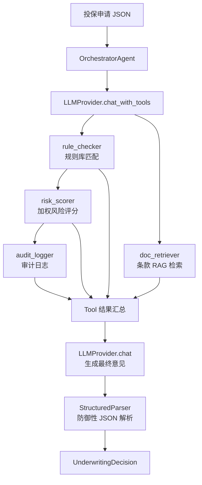

# Insurance Underwriting Agent

> 金融隔离网络环境下的核保前置检查 Agent —— 模型无关、Tool-First、可审计

**[在线演示 →](https://please-zhang.github.io/Insurance-Underwriting-Agent/)** 一份投保申请如何经过 AI Agent 处理？点进去看完整的工具调度流程。

---

## 背景与痛点

保险核保是一个规则密集、合规敏感的业务环节。一份投保申请要经过年龄校验、既往症审查、产品条款匹配、风险评分等多个核查步骤，传统做法是把几千条核保规则硬编码在存储过程或后端代码里，由核保员逐条人工复核。

这带来三个长期痛点：

1. **规则维护成本高** —— 产品条款每季度更新，改一条规则可能影响数十个分支逻辑，回归测试成本极大
2. **优质核保员稀缺** —— 核保需要医学、精算、法规的交叉知识，培养周期长，流动率高
3. **简单件占据大量人力** —— 超过60%的投保申请是标准体、低保额，几乎不需要人工判断，却仍然排在核保员的队列里

2025-2026年大模型能力快速提升，让"AI 自主完成核查前几步，人只复核复杂件"成为可能。但金融行业有两个硬约束使得"直接用 ChatGPT API"这条路走不通：

- **网络隔离**：银行、保险公司的生产网络无法访问外部 API，只能用内网部署的开源模型
- **输出不可靠**：LLM 的输出是概率性的，不能直接替代有法律效力的承保接口

本项目就是在这些约束下设计的解决方案。

---

## 这个项目做了什么

一个**任务完成型 AI Agent**：输入一份投保申请 JSON，Agent 自主规划核查步骤、调度多个工具并行执行、输出结构化核保意见。

```
投保申请 → OrchestratorAgent → 并行调用工具 → 结构化核保意见
                ↑
        LLMProvider（切换模型只改配置文件）
```



---

## 关键设计决策

### 1. 模型无关架构 —— 不是技术秀，是金融行业的刚需

业务代码不直接依赖任何 LLM SDK。`LLMProvider` 抽象接口隔离了模型差异，切换模型只改 `config/providers.yaml`：

```yaml
active_provider: claude   # 改成 glm4 即切到内网模型
```

| 环境 | 模型 | 接入方式 |
|------|------|---------|
| 外网开发 | Claude | Anthropic SDK，原生 Tool Use |
| 内网生产 | GLM4.7 | OpenAI 兼容 API，Tool Use 自动降级 |

GLM4 不支持原生 Tool Use 时，`GLM4Provider` 自动降级为 prompt 内嵌工具描述，Agent 流程不中断。

### 2. Tool-First 而非 Prompt-First

核查能力不写在 prompt 里，而是封装为独立的 Tool：

| Tool | 职责 | 是否依赖 LLM |
|------|------|-------------|
| `rule_checker` | 匹配核保规则库，检测一票否决 | 否 |
| `doc_retriever` | RAG 检索产品条款（ChromaDB 本地） | 否 |
| `risk_scorer` | 加权规则引擎计算风险分数 | 否 |
| `audit_logger` | 写审计日志（JSONL） | 否 |

LLM 只负责两件事：**规划调用哪些工具**和**汇总工具结果生成最终意见**。核心计算全部确定性完成。

新增核查维度（如财务审查、职业风险）= 加一个 Tool 文件，不改 Orchestrator。

### 3. 拓扑排序 + 并行调度

工具之间有依赖关系（`risk_scorer` 依赖 `rule_checker` 的结果），但 `rule_checker` 和 `doc_retriever` 可以并行。

Orchestrator 对 LLM 返回的工具调用列表做拓扑排序，按轮次执行：

```
Round 1（并行）: rule_checker, doc_retriever
Round 2:         risk_scorer（等 rule_checker 完成）
Round 3:         audit_logger（等 risk_scorer 完成）
```

响应时间从串行 ~8s 降到并行 ~4s。

### 4. Hard Stop 早退

核保规则中有"一票否决"（如年龄超75岁、糖尿病未受控）。Orchestrator 在每一轮工具执行后检查 `hard_stops`，如果触发，直接返回 DECLINED，不再消耗后续 LLM 调用。

### 5. 防御性输出解析 —— 不信任 LLM 的输出

LLM 的 JSON 输出可能格式不标准。`StructuredParser` 是一个4层兜底链：

```
尝试1: 直接 json.loads()
尝试2: 提取 ```json ... ``` 代码块
尝试3: 正则提取最大 { ... } 块
尝试4: 让 LLM 重新格式化
全部失败: 返回 REQUEST_MORE_INFO（建议人工复核）
```

**永远不让系统崩，最差情况是建议人工复核。**

---

## 关于落地：为什么 LLM 的输出不能直接用

这个问题在设计之初就想清楚了：**核保是有法律效力的，LLM 的输出只能是"预核保建议"，不能替代承保接口。**

真实落地分三个阶段：

**第一阶段：影子模式（Shadow）**
Agent 和现有核保系统并行跑同一批申请，Agent 的结果不生效，只做对比统计。`audit_logger` 记录每一笔处理过程，为后续分析提供数据。

**第二阶段：辅助模式（Copilot）**
当影子模式的决策一致率达到阈值（标准件 95%+），Agent 向核保员提供预核保建议。核保员可以采纳也可以推翻，最终决策权在人。

**第三阶段：自动化简单件（Auto-approve）**
对规则明确、风险极低的标准件（如25岁健康体投10万保额），Agent 自动通过。核保员只处理复杂件和异常件。

每个阶段都有数据支撑，不是拍脑袋。

### 模型一致性验证（A/B 测试）

影子模式的核心是对比验证。`test_model_parity` 验证同一份申请在不同模型下的决策一致性：

```python
# 核心结论必须一致
assert claude_result.decision == glm4_result.decision

# 风险等级必须一致
assert claude_result.risk_level == glm4_result.risk_level

# 风险分数差异不超过 20 分
assert abs(claude_result.risk_score - glm4_result.risk_score) <= 20
```

这个测试同时也是模型升级的回归测试——内网模型从 GLM4 升到 GLM5 时，跑一次就知道行为有没有偏移。

---

## Demo 与真实系统的差距

坦诚说明：这是一个架构原型，不是生产系统。

| 维度 | Demo | 真实系统 |
|------|------|---------|
| 入参字段 | ~10个核心字段 | 200+ 字段（健康告知、财务、职业等） |
| 规则数量 | 10条 | 几千条，按产品线分组 |
| 数据来源 | 仿真数据（faker 生成） | 真实投保书 |
| 部署方式 | 本地 CLI | 微服务 + 消息队列 |
| 审批流 | 无 | 多级审批 + 转人工 |

但架构是为扩展设计的：
- 入参扩展 → 扩展 `ApplicationInput` 的 Pydantic 模型
- 规则扩展 → 往 `underwriting_rules.json` 加规则，不改代码
- 核查维度扩展 → 加一个 Tool 文件，注册到 Orchestrator
- 模型切换 → 改 `providers.yaml`，代码零改动

---

## 快速启动

```bash
# 安装
pip install -r requirements.txt

# 配置
cp config/providers.example.yaml config/providers.yaml
# 编辑 providers.yaml，填入 API Key 或内网模型地址

# 运行
python -m agent.cli --input data/synthetic/sample_application.json
python -m agent.cli --demo              # 跑三个仿真场景
python -m agent.cli --provider glm4     # 切换到 GLM4

# 测试
pytest -m "not integration" -v          # 单元测试（不消耗 token）
pytest tests/test_model_parity.py -m integration -v  # 模型一致性（需双模型）
```

**输出示例：**

```
=== 核保结果 ===
申请ID: APP-2026-001
决策: APPROVED_WITH_LOADING（加费承保）
风险等级: MEDIUM（评分: 62/100）
理由:
  - 高血压已受控，建议加费承保
  - 不吸烟，正向因素
处理耗时: 3842ms
调用工具: rule_checker, doc_retriever, risk_scorer, audit_logger
```

---

## 测试设计

三层测试，各有分工：

| 层级 | 文件 | 依赖 LLM | 用途 |
|------|------|---------|------|
| 单元测试 | `test_tools.py`, `test_models.py`, `test_parser.py` | 否 | 每个 Tool 和解析器独立验证 |
| 集成测试 | `test_orchestrator.py` | Mock | 完整流程：调度顺序、hard stop 早退、解析失败兜底 |
| 端到端 | `test_model_parity.py` | 真实调用 | Claude vs GLM4 决策一致性 |

日常开发只跑前两层（秒级）。模型切换或升级时跑第三层。

---

## 项目结构

```
agent/
  cli.py                    # 命令行入口
  orchestrator.py            # 核心：Agent 调度、拓扑排序、hard stop 检测
  output/
    models.py                # Pydantic 数据模型
    parser.py                # 4层防御性 JSON 解析
  tools/
    base.py                  # Tool 抽象基类
    rule_checker.py          # 核保规则匹配
    doc_retriever.py         # ChromaDB 本地 RAG
    risk_scorer.py           # 加权风险评分引擎
    audit_logger.py          # 审计日志
providers/
  base.py                    # LLMProvider 抽象接口
  claude_provider.py         # Anthropic Claude（外网）
  glm4_provider.py           # GLM4 OpenAI 兼容（内网）
data/
  rules/                     # 核保规则库（JSON）
  docs/                      # 产品说明书（RAG 数据源）
  synthetic/                 # 仿真投保申请
tests/                       # 三层测试
```

详细架构设计见 [ARCHITECTURE.md](./ARCHITECTURE.md)，设计决策说明见 [DESIGN.md](./DESIGN.md)，接口规范见 [API_SPEC.md](./API_SPEC.md)。

---

## 技术栈

| 组件 | 选型 | 理由 |
|------|------|------|
| LLM 调用 | Claude SDK / OpenAI SDK | 原生 Tool Use，不依赖 LangChain |
| 数据验证 | Pydantic v2 | 自动校验 LLM 输出字段类型 |
| 向量检索 | ChromaDB（本地） | 内网可用，无需云服务 |
| 测试 | pytest + pytest-asyncio | async 全链路测试 |

**为什么不用 LangChain：** 抽象层过重，引入了不必要的复杂度。Claude SDK 的 Tool Use API 足够清晰，自己写 Orchestrator 只需约 300 行，每一个调度决策都是透明可解释的。

---

## License

MIT
